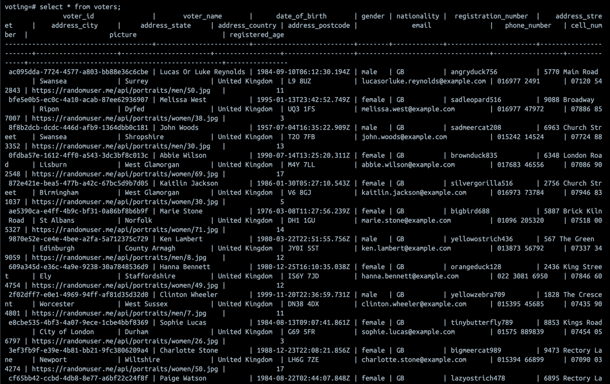
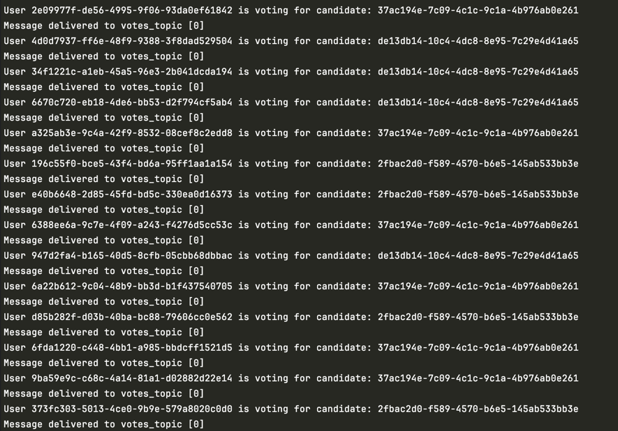
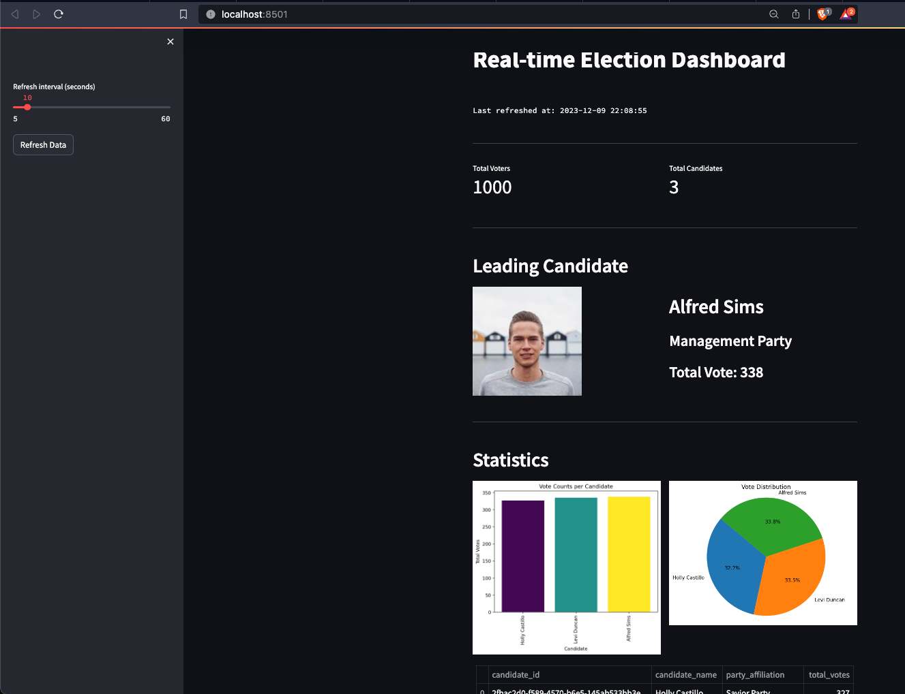

---

# Election Data Pipeline

This repository contains the code for a real-time election data pipeline built using Python, Kafka, Spark Streaming, PostgreSQL, and Streamlit. Docker Compose is used to easily spin up the required services in Docker containers.

## System Architecture


## System Components
- **main.py**: Creates tables in PostgreSQL (`candidates`, `voters`, and `votes`), creates Kafka topics, and populates the `votes` table into Kafka. It also includes logic to consume votes from Kafka and produce data to the `voters_topic` on Kafka.
- **voting.py**: Contains logic to consume votes from the `voters_topic` Kafka topic, generate voting data, and produce data to the `votes_topic` Kafka topic.
- **spark-streaming.py**: Contains logic to consume votes from the `votes_topic` Kafka topic, enrich the data from PostgreSQL, aggregate votes, and produce data to specific Kafka topics.
- **streamlit-app.py**: Contains logic to consume aggregated voting data from Kafka and PostgreSQL and display real-time voting data using Streamlit.

## Setting up the System

This Docker Compose file allows you to easily spin up Zookeeper, Kafka, and PostgreSQL in Docker containers.

### Prerequisites
- Python 3.9 or above
- Docker Compose
- Docker

### Steps to Run

1. **Clone the Repository:**
   ```bash
   git clone https://github.com/sathvik-ng-07/Election-Data-Pipeline.git
   cd Election-Data-Pipeline
   ```

2. **Start the Services:**
   Run the following command to start Zookeeper, Kafka, and PostgreSQL containers in detached mode:
   ```bash
   docker-compose up -d
   ```
   Kafka will be accessible at `localhost:9092` and PostgreSQL at `localhost:5432`.

3. **Install Python Packages:**
   ```bash
   pip install -r requirements.txt
   ```

4. **Create Tables and Populate Data:**
   ```bash
   python main.py
   ```

5. **Generate Voting Data:**
   ```bash
   python voting.py
   ```

6. **Stream and Aggregate Data:**
   ```bash
   python spark-streaming.py
   ```

7. **Run the Streamlit App:**
   ```bash
   streamlit run streamlit-app.py
   ```

### Additional Configuration

If you need to modify Zookeeper configurations or change the exposed port, update the `docker-compose.yml` file as needed.

## Screenshots

### Candidates and Parties Information


### Voters


### Voting


### Dashboard


---
